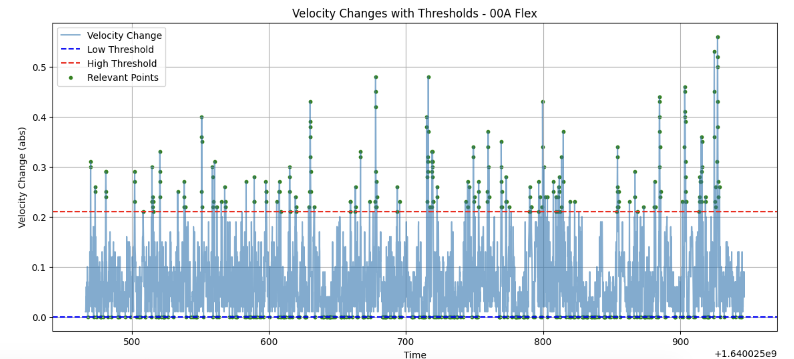
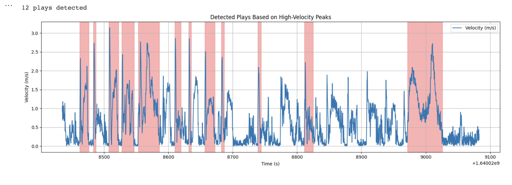
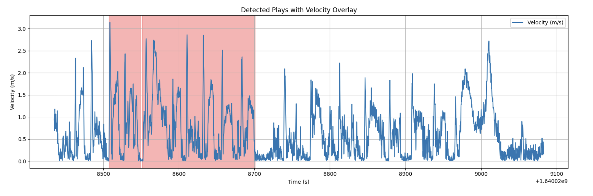
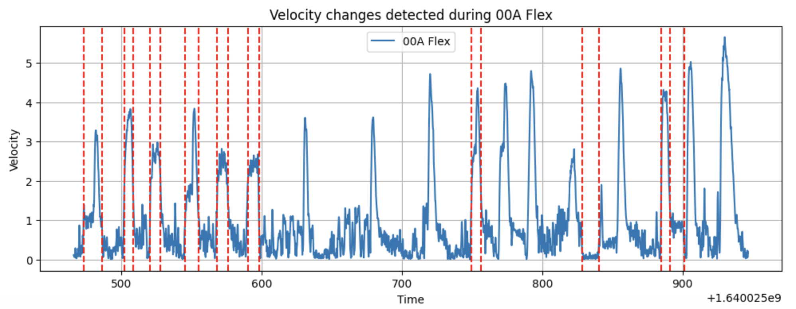
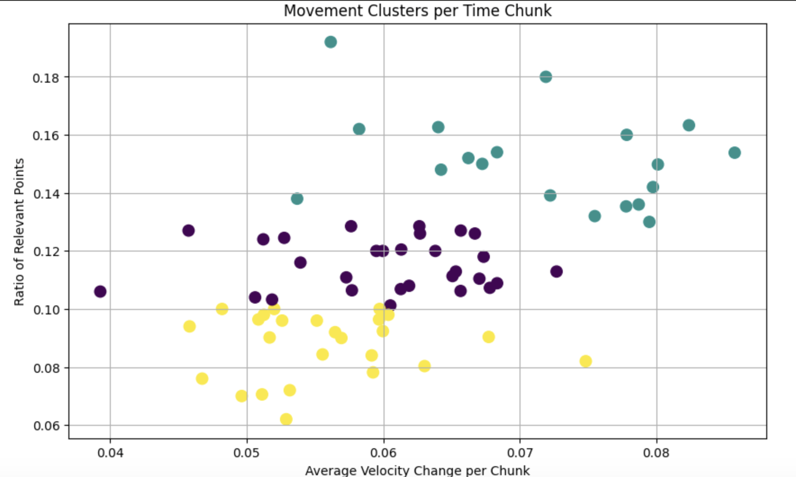

<html lang="en">
<head>
    <meta charset="UTF-8">
    <meta name="viewport" content="width=device-width, initial-scale=1.0">
    <title>D1 Football — Tracking Data Analytics System</title>

    <link href="https://fonts.googleapis.com/css2?family=Inter:wght@300;400;600;700&display=swap" rel="stylesheet">

    
</head>

<body>

<header>
    <h1>Football Tracking Data Analytics System</h1>
    
GPS Tracking • Play Detection • Movement Modeling • Clustering

</header>

    <h2>Project Overview</h2>

    

        This project built an end-to-end analytics system for NCAA Division I football GPS tracking data.
        It transformed raw athlete movement data (x, y position + velocity over time) into structured “plays”
        that could be used to analyze workload, movement intensity, and behaviors.
    

    

        Starting from raw sensor data, I built a full pipeline including data cleaning, signal processing,
        play segmentation, event detection, and clustering of movement patterns.
    

    <h2>End-to-End Pipeline</h2>

    

        Raw GPS Data → Cleaning & Filtering → Velocity Signal Processing → Play Detection → 
        Change-Point Validation → Period Mapping → Trajectory Clustering → Output Plays
    

    <h2>1. Data Processing & Preperation</h2>

    

        The raw dataset consists of GPS tracking data containing player position (x, y),
        velocity, acceleration, timestamps, etc.
    

    

        Preprocessing steps included:
    

    <ul>
        <li>Filtered individual athletes from team tracking streams</li>
        <li>Sorted and aligned time-series data</li>
        <li>Handled missing or noisy velocity values</li>
        <li>Standardized timestamps across drills</li>
    </ul>

    <h2>2. Movement Signal Processing</h2>

    

        This velocity delta signal became a key feature for detecting transitions between movement states (rest → acceleration → active     play).
    

    <pre><code>
df['dv'] = df['v'].diff().abs()
    </code></pre>

    

        This distribution was tracking one player across the time interval of one drill ran at practice. Velocity change signals (dv) were computed from raw GPS velocity data to identify meaningful movement transitions.
        Threshold-based filtering was used to isolate high-intensity changes while reducing noise from small fluctuations.
        Green points represent movement events that exceeded adaptive percentile thresholds.
    

        

    <h2>3. Play Detection Engine (Time-Series Segmentation)</h2>

    

        A custom rule-based segmentation system was made to detect discrete “plays” from continuous movement data.
        A play is defined as a bounded time interval where a players' velocity exceeds a dynamic threshold and then returns to baseline.
    

    
    

        The algorithm uses both:
    

    
    <ul>
        <li>Velocity thresholding (high-intensity movement detection)</li>
        <li>Temporal continuity constraints (preventing false splits)</li>
        <li>Pause-time tolerance for directional changes</li>
    </ul>
    
    <pre><code>
    if v >= high_thresh:
        peak_start = i
    
    while next_v > low_thresh:
        end_idx += 1
    </code></pre>
    
    

            This approach ensures that each detected segment shows a physically meaningful play rather than short noise spikes in sensor data. Detected play segments are highlighted in red. Plays were identified by locating sustained high-velocity movement periods bounded by lower activity thresholds and pause-tolerant segmentation rules.
    

    

        
        
    

   <h2>4. Change-Point Detection (Signal Validation)</h2>

    To validate rule-based segmentation, I implemented statistical change-point detection using
    the PELT algorithm with an RBF kernel to detect structural shifts in velocity time-series data.

<pre><code>
algo = rpt.Pelt(model="rbf").fit(vel)
change_points = algo.predict(pen=30)
</code></pre>

    This allowed cross-validation between heuristic play detection and statistically inferred motion changes,improving segmentation reliability. Statistical change-point detection was applied to player velocity signals using the PELT algorithm. Red dashed lines indicate detected structural shifts in movement intensity, helping validate play segmentation boundaries.

        

    <h2>5. Interval Tree Based Segmentation</h2>

    Interval trees were used to efficiently map GPS timestamps to drill and practice periods,
    enabling fast lookup of contextual metadata for each athlete movement event.

    
    <pre><code>
    tree.addi(start, end, period_name)
    matches = trees[athlete][time]
    </code></pre>

    <h2>6. Movement Pattern Clustering</h2>

    To analyze behavioral patterns across time windows, I aggregated 5-second movement chunks and extracted features such as:
    average velocity change and frequency of high-intensity movement events.

<pre><code>
kmeans = KMeans(n_clusters=3, random_state=42)
labels = kmeans.fit_predict(X)
</code></pre>

    Five-second movement windows were clustered using KMeans based on average velocity change and frequency of high-intensity movement events. This made three interpretable movement states:

<ul>
    <li><b>Low Activity:</b> Resting, walking, recovery phases</li>
    <li><b>Moderate Activity:</b> Repositioning and transitional movement</li>
    <li><b>High Activity:</b> Sprinting, cutting, and game-speed exertion</li>
</ul>

        

   <h2>What This Project Demonstrates</h2>

<ul>
    <li>Built a full pipeline for processing football tracking data.</li>
    <li>Created movement features from raw GPS sensor data.</li>
    <li>Combined threshold methods with statistical modeling for play detection.</li>
    <li>Applied change-point detection to noisy player movement signals.</li>
    <li>Used KMeans clustering to identify movement and behavior patterns.</li>
</ul>

<footer>
    © 2025 | Data Science Portfolio — Kailani Wang
</footer>

</body>
</html>
