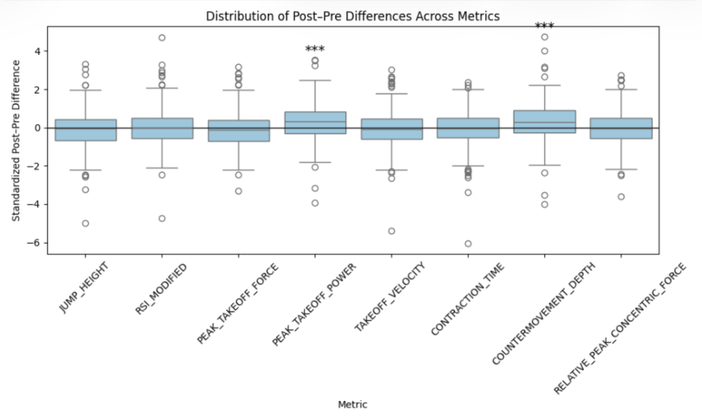
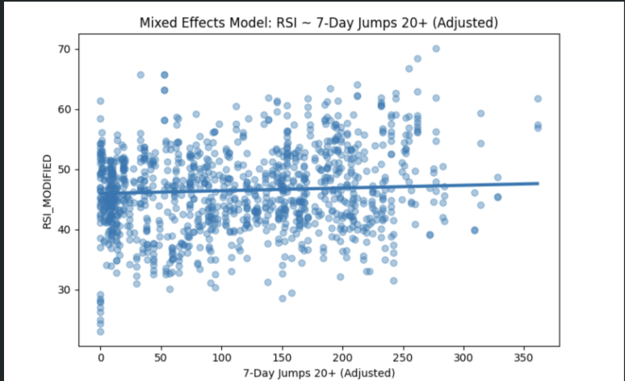
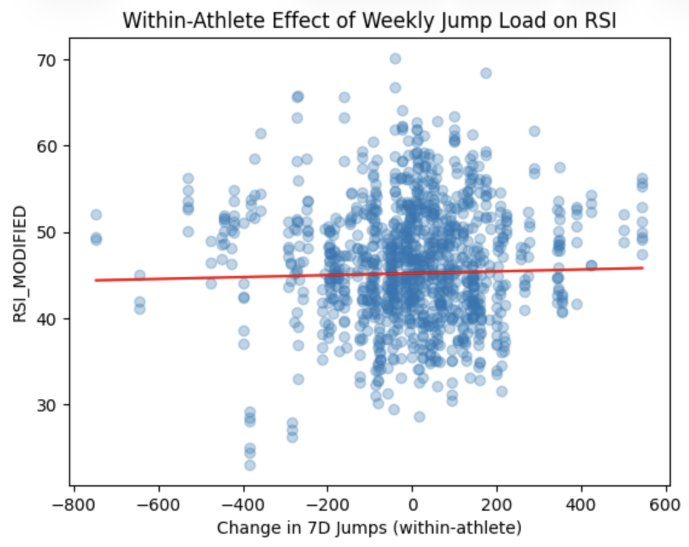
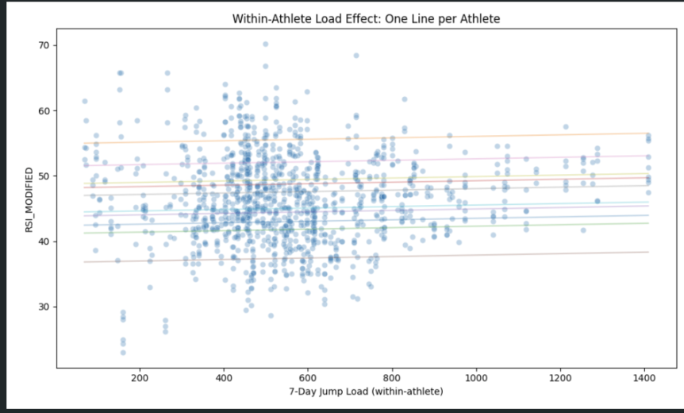

<html lang="en">
<head>
    <meta charset="UTF-8">
    <meta name="viewport" content="width=device-width, initial-scale=1.0">
    <title>Volleyball CMJ Load & Readiness Analysis</title>

    <link href="https://fonts.googleapis.com/css2?family=Inter:wght@300;400;600;700&display=swap" rel="stylesheet">

    <!-- Highlight.js -->
    <link rel="stylesheet"
          href="https://cdnjs.cloudflare.com/ajax/libs/highlight.js/11.9.0/styles/default.min.css">
    

    
</head>

<body>

<header>
    <h1>D1 Volleyball — CMJ Load & Readiness Analysis</h1>
    
Sports Analytics • Mixed Models • Athlete Monitoring • Load Analysis

</header>

    
    <h2>Project Overview</h2>

    

        This project evaluated whether Countermovement Jump (CMJ) metrics can be used to monitor
        athlete fatigue, workload adaptation, and neuromuscular readiness in NCAA Division I volleyball athletes.
    

    

        Using force plate testing data alongside wearable jump-load monitoring data,
        I built a full data analysis workflow involving data cleaning, feature engineering,
        longitudinal athlete monitoring, mixed-effects modeling, and statistical hypothesis testing.
    

    

        The primary goal was to determine whether short-term and long-term workload metrics
        meaningfully predict changes in CMJ performance variables such as RSI_Modified,
        Jump Height, Peak Takeoff Power, and Contraction Time.
    

    
    <h2>End-to-End Analytics Pipeline</h2>

    

        Raw CMJ Force Plate Data + VERT IMU Load Data →
        Data Cleaning & Standardization →
        Athlete ID Matching →
        Pre/Post Practice Pairing →
        Feature Engineering →
        Acute Load Statistical Testing →
        Rolling Load Calculations →
        Mixed Effects Modeling →
        Athlete-Specific Trend Analysis →
        Interpretation of Fatigue & Adaptation Responses
    

    <h2>1. Data Sources & Performance Metrics</h2>

    

        Two primary datasets were combined for this project:
    

    <ul>
        <li>
            <strong>VALD ForceDecks CMJ Data</strong> — force plate measurements from
            pre- and post-practice Countermovement Jump tests.
        </li>

        <li>
            <strong>VERT IMU Load Data</strong> — wearable athlete monitoring data
            containing jump counts, movement load estimates, and rolling workload metrics.
        </li>
    </ul>
    
   <h2>2. Data Cleaning & Dataset Construction</h2>

    The raw datasets required substantial preprocessing before analysis.
    Athlete IDs were inconsistent between systems, timestamps used different formats,
    and several force plate variables contained malformed strings.

<ul>
    <li>Standardized timestamps and timezones</li>
    <li>Matched athlete IDs across systems</li>
    <li>Paired pre/post practice CMJ sessions</li>
    <li>Cleaned malformed numeric force plate variables</li>
    <li>Built athlete-day level datasets</li>
</ul>

<pre><code class="language-python">
df_cmj['date'] = (
    pd.to_datetime(df_cmj['recordedUTC'],
                   utc=True,
                   errors='coerce')
    .dt.tz_convert('US/Pacific')
    .dt.date
)

df_load['date'] = (
    pd.to_datetime(df_load['start_date'],
                   format='%d/%m/%Y',
                   errors='coerce')
    .dt.date
)
</code></pre>

    <h2>3. Acute Fatigue Analysis (Pre vs Post Practice)</h2>

    Pre-practice and post-practice CMJ tests were paired within each athlete
    to measure acute changes in neuromuscular performance following training sessions.

<pre><code class="language-python">
for col in metrics:

    df_wide[f'{col}_diff'] = (
        df_wide[f'{col}_Post']
        - df_wide[f'{col}_Pre']
    )

tstat, pval = ttest_1samp(subset, 0)
</code></pre>

    

    Standardized post-practice minus pre-practice CMJ differences were visualized
    across performance metrics. Most variables remained relatively stable following practice,
    although Peak Takeoff Power and Countermovement Depth showed statistically significant         increases.

   <h2>4. Regression Modeling of Jump Performance</h2>

    Multiple regression models were used to evaluate whether
    pre-practice CMJ metrics could predict post-practice jump performance.

<pre><code class="language-python">
X = df_wide[[
    'JUMP_HEIGHT_Pre',
    'TAKEOFF_VELOCITY_Pre',
    'PEAK_TAKEOFF_POWER_Pre'
]]

y = df_wide['JUMP_HEIGHT_Post']

model = LinearRegression()
model.fit(X, y)
</code></pre>

    Pre-practice Jump Height and Takeoff Velocity showed
    the strongest relationships with post-practice performance.

    <h2>5. Rolling Workload Calculations</h2>

    Rolling 7-day and 21-day workload features were constructed
    to monitor cumulative athlete training stress throughout the season.

<pre><code class="language-python">
all_jumps = np.cumsum(jumps, axis=1)

jumps21 = (
    all_jumps[:,21:]
    - all_jumps[:,:-21]
)
</code></pre>

    

    Adjusted rolling workload features were evaluated against RSI_Modified
    to examine whether increases in short-term jump load were associated
    with changes in neuromuscular readiness. Acute:Chronic workload ratios (ACWR) were also         evaluated to identify short-term workload spikes.

<h2>6. Mixed Effects Modeling</h2>

    Because athlete monitoring data contains repeated measurements
    from the same athletes over time, mixed-effects models were used
    to separate individual athlete baselines from workload fluctuations.

<pre><code class="language-python">
df['mean_7d'] = (
    df.groupby('athlete')['load_7d']
    .transform('mean')
)

df['within_7d'] = (
    df['load_7d']
    - df['mean_7d']
)

model = smf.mixedlm(
    'RSI ~ within_7d + mean_7d',
    data=df,
    groups='athlete'
).fit()
</code></pre>

    

    Each point represents an individual CMJ test observation.
    The fitted mixed-model trend line estimates the average within-athlete relationship
    between weekly jump load and RSI_Modified after accounting for athlete-specific baselines. This approach helped evaluate whether increases in workload
    relative to an athlete's own baseline were associated with
    changes in neuromuscular readiness.

 <h2>7. Athlete-Specific Load Response Visualization</h2>

    Individual athlete regression plots were created
    to visualize how workload relationships differed across players. Relationships between workload and performance varied considerably
    across athletes, reinforcing the importance of individualized monitoring.

<pre><code class="language-python">
for athlete, group in df.groupby('athlete'):

    sns.regplot(
        x=group['load_7d'],
        y=group['jump_height']
    )
</code></pre>

    

    Separate regression lines were generated for each athlete to visualize
    individual workload-performance relationships. Trends varied considerably
    across players, reinforcing the importance of athlete-specific monitoring
    rather than relying entirely on team-wide averages.

    <h2>What This Project Demonstrates</h2>

    <ul>
        <li>Built a full sports analytics workflow using real athlete monitoring data.</li>

        <li>Cleaned and merged multi-source longitudinal datasets.</li>

        <li>Applied mixed-effects statistical modeling for repeated athlete measurements.</li>

        <li>Engineered rolling workload and ACWR features from wearable sensor data.</li>

        <li>Performed paired statistical testing and regression analysis.</li>

        <li>Visualized individualized athlete load-response relationships.</li>

        <li>Translated statistical results into applied sports science interpretations.</li>
    </ul>

<footer>
    © 2025 | Data Science Portfolio — Kailani Wang
</footer>

</body>
</html>
